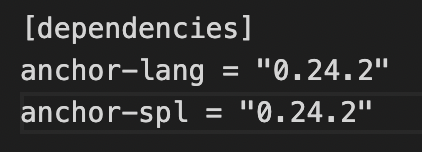
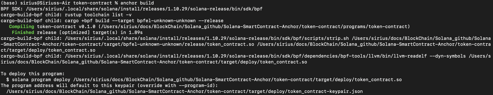
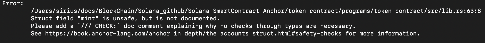
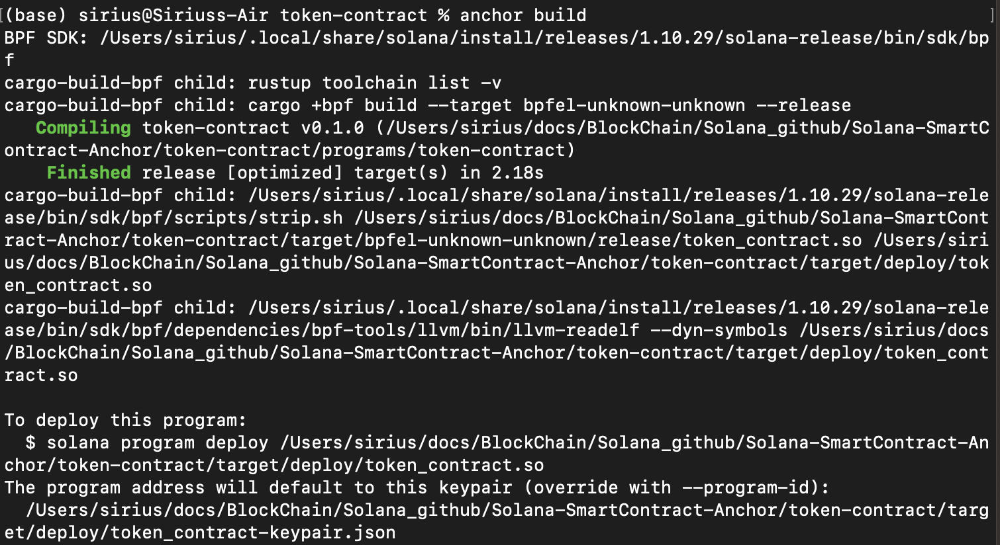
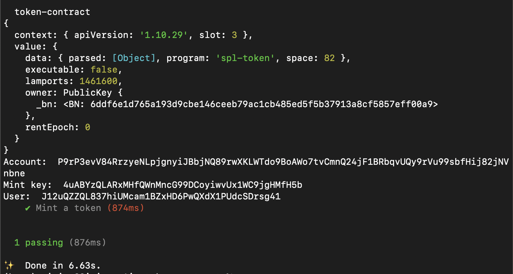
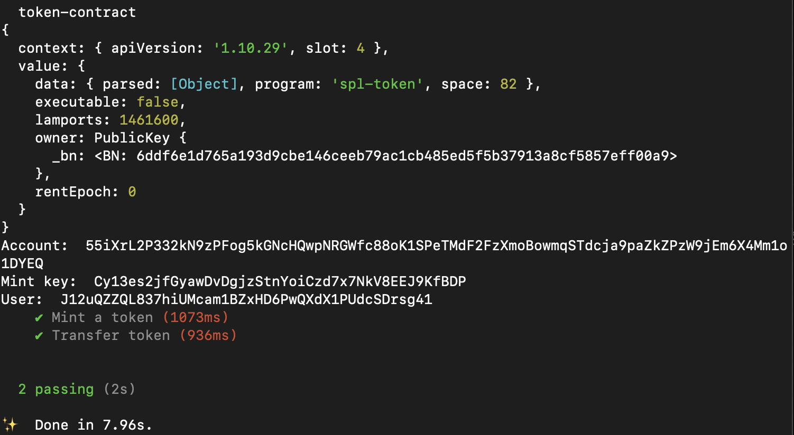

# Solana-SmartContract-Anchor
## Minting and Transfering Token/NFT with Anchor

* 這邊的內容是參考[Youtube video: Solana Smart Contract: Minting and Transfering Token/NFT with Anchor](https://youtu.be/3GHlk6vosQw)影片做的筆記

* What is anchor?
A framework for quickly building secure Solana programs.

## Reference:
1. [Youtube video: Solana Smart Contract: Minting and Transfering Token/NFT with Anchor](https://youtu.be/3GHlk6vosQw)
2. [Anchor Installation](https://www.anchor-lang.com/docs/installation)
3. [Anchor book](https://book.anchor-lang.com/)
4. [Anchor github](https://github.com/coral-xyz/anchor)
5. [Solana Token Program](https://spl.solana.com/)
6. [Josh大神Github](https://github.com/chang47/Anchor-Mint-and-Transfer-Smart-Contract)
7. [Rust docs about anchor_spl](https://docs.rs/anchor-spl/latest/anchor_spl/)
8. [Rust docs about spl-token](https://docs.rs/spl-token/latest/spl_token/)

## Goals
- Write smart contract to mint and transfer tokens
- Write tests to validate the program

### Create an anchor project
- Initial 
```
    anchor init token-contract
    cd token-contract
```
- Set Test
```
    yarn add ts-mocha 
    anchor test
```
- 到Cargo.tomltoken-contract/programs/token-contract/Cargo.toml)修改套件版本和新增套件，不然會報錯


### Part 1. Write the smart contract
#### Steps
##### 1. Writing Token mint transacion
* Give a token, mint a token to a account
* Mint Transaction Requirements
    * Token program for our CpiContext
    * Amount to mint
    * The token account that represent our token
    * Who we want to mint tokens to
    * The token authority to allow us to mint
1. 參考[Rust mint_to](https://docs.rs/anchor-spl/latest/anchor_spl/token/fn.mint_to.html)文件在[lib.rs](token-contract/programs/token-contract/src/lib.rs)檔案中新增mint function需要調用的參數
```rust
#[derive(Accounts)]
pub struct MintToken<'info> {
    #[account(mut)]
    pub mint: AccountInfo<'info>,
    pub token_program: Program<'info, Token>,
    #[account(mut)]
    pub to: AccountInfo<'info>,
    #[account(mut)]
    pub authority: AccountInfo<'info>,
}
```
2. 新增mint token function在token_contract中
```rust
pub fn mint_token(ctx: Context<MintToken>) -> Result<()> {
        let cpi_accounts = MintTo {
        mint: ctx.accounts.mint.to_account_info(), 
        to: ctx.accounts.token_account.to_account_info(),
        authority: ctx.accounts.authority.to_account_info(),
        };

        let cpi_program = ctx.accounts.token_program.to_account_info();
        let cpi_ctx = CpiContext::new(cpi_program, cpi_accounts);
        token::mint_to(cpi_ctx, 10)?;
        Ok(())
    }
```

##### 2. Transfer transaction
* Transfer token from one account to another
* Transfer Transaction requirements
    * Token program for our CpiContext
    * Amount to transfer
    * The sender's associated token account
    * The reciver's associated token account
    * The sender's authority to approve the transfer

1. 參考[Rust Transfer](https://docs.rs/anchor-spl/latest/anchor_spl/token/struct.Transfer.html)文件在[lib.rs](token-contract/programs/token-contract/src/lib.rs)檔案中新增Transfer function需要調用的參數
```rust
#[derive(Accounts)]
pub struct Transfer<'info> {
    pub token_program: Program<'info, Token>,
    #[account(mut)]
    pub from: AccountInfo<'info>,
    #[account(mut)]
    pub to: AccountInfo<'info>,
    pub authority: AccountInfo<'info>,
}
```
2. 新增Transfer function在token_contract中
```rust
pub fn transfer_token(ctx: Context<TransferToken>) -> Result<()> {
        let transfer_instruction = Transfer{
            from: ctx.accounts.from.to_account_info(),
            to: ctx.accounts.to.to_account_info(),
            authority: ctx.accounts.authority.to_account_info(),
        };
         
        let cpi_program = ctx.accounts.token_program.to_account_info();
        let cpi_ctx = CpiContext::new(cpi_program, transfer_instruction);
        anchor_spl::token::transfer(cpi_ctx, 5)?;
        Ok(())
    } 
```

##### 3. `anchor build`
成功會長這樣


```
To deploy this program:
  $ solana program deploy /Users/sirius/docs/BlockChain/Solana_github/Solana-SmartContract-Anchor/token-contract/target/deploy/token_contract.so
The program address will default to this keypair (override with --program-id):
  /Users/sirius/docs/BlockChain/Solana_github/Solana-SmartContract-Anchor/token-contract/target/deploy/token_contract-keypair.json
```

* 注意！
因為我們在Account前加了 `#[account(mut)]`讓Account是可以變動的，anchor不喜歡他會抱怨，所以我們要在每一個`#[account(mut)]`前面加上anchor規定的`/// CHECK: blabla~~~~`他才不會抱怨喔！


加完`/// CHECK: blabla~~~~`再`anchort build`一次，他就沒有抱怨啦！



* Mint 和 Transfer的設定其實很像，[lib.rs](token-contract/programs/token-contract/src/lib.rs)中有詳細的註解，也可以回到Josh大神的影片去看詳細的解釋喔！

### Part 2. Write tests to validate the program
* Initial : 在[package.json](token-contract/package.json)中加入我們要用到的solana套件`"@solana/spl-token":"^0.3.4"，記得加完之後要`npm install`喔！
- Test will create fake wallets, tokens, and ATA for our wallet 

#### Steps
##### 1. 基本設定
```rust
  anchor.setProvider(anchor.AnchorProvider.env());
  const program = anchor.workspace.TokenContract as Program<TokenContract>;
  const mintKey: anchor.web3.Keypair = anchor.web3.Keypair.generate();
  let associatedTokenAccount = undefined;
```
##### 2. 來寫mint tset
- 每個it都代表一個test
- 內容
    1. 提取帳戶資訊
    2. mint token
    3. create mint account
    4. create ATA account to hold the token
    5. create transaction & send transaction
    6. start testing
```rust
it("Mint a token", async () => {
    // 1. 提取帳戶資訊
    const key = anchor.AnchorProvider.env().wallet.publicKey;
    const lamports: number = await program.provider.connection.getMinimumBalanceForRentExemption(
      MINT_SIZE
    );

    associatedTokenAccount = await getAssociatedTokenAddress(
      mintKey.publicKey,
      key
    );

    // 2. mint token
    const mint_tx = new anchor.web3.Transaction().add(
      anchor.web3.SystemProgram.createAccount({
        fromPubkey: key, 
        newAccountPubkey: mintKey.publicKey, 
        space: MINT_SIZE, 
        programId: TOKEN_PROGRAM_ID, 
        lamports,
      }),
      
    // 3. create mint account
      createInitializeMintInstruction(
        mintKey.publicKey, 0, key, key
      ),
    
    // 4. create ATA account to hold the token
      createAssociatedTokenAccountInstruction(
        key, associatedTokenAccount, key, mintKey.publicKey
      )
    );

    // 5. create transaction & send transaction
    const res = await anchor.AnchorProvider.env().sendAndConfirm(mint_tx, [mintKey]);

    console.log(
      await program.provider.connection.getParsedAccountInfo(mintKey.publicKey)
    );

    console.log("Account: ", res);
    console.log("Mint key: ", mintKey.publicKey.toString());
    console.log("User: ", key.toString());

    // 6. start testing
    // 調用token_contract(anchor build後會存在token-contract/target/types/token_contract.ts)
    await program.methods.mintToken().accounts({
      mint: mintKey.publicKey,
      tokenProgram: TOKEN_PROGRAM_ID,
      to: associatedTokenAccount,
      authority: key,
    }).rpc();

    const minted = (await program.provider.connection.getParsedAccountInfo(associatedTokenAccount)).value.data.parsed.info.tokenAmount.amount;
    assert.equal(minted, 10);
  });
```
##### 3. Test mint token `anchor test`


```
token-contract
{
  context: { apiVersion: '1.10.29', slot: 3 },
  value: {
    data: { parsed: [Object], program: 'spl-token', space: 82 },
    executable: false,
    lamports: 1461600,
    owner: PublicKey {
      _bn: <BN: 6ddf6e1d765a193d9cbe146ceeb79ac1cb485ed5f5b37913a8cf5857eff00a9>
    },
    rentEpoch: 0
  }
}
Account:  P9rP3evV84RrzyeNLpjgnyiJBbjNQ89rwXKLWTdo9BoAWo7tvCmnQ24jF1BRbqvUQy9rVu99sbfHij82jNVnbne
Mint key:  4uABYzQLARxMHfQWnMncG99DCoyiwvUx1WC9jgHMfH5b
User:  J12uQZZQL837hiUMcam1BZxHD6PwQXdX1PUdcSDrsg41
    ✔ Mint a token (874ms)


  1 passing (876ms)

✨  Done in 6.63s.
```

##### 4. 來寫transfer test
- 內容
    1. 提取帳戶資訊
    2. Sends and create the transaction
    3. 執行 transfer smart contract 
    4. testing 
```rust
it("Transfer token", async () => {
    // 1. 提取帳戶資訊
    const myWallet = anchor.AnchorProvider.env().wallet.publicKey;
    const toWallet: anchor.web3.Keypair = anchor.web3.Keypair.generate();
    const toATA = await getAssociatedTokenAddress(
      mintKey.publicKey,
      toWallet.publicKey
    );

    // Fires a list of instructions
    const mint_tx = new anchor.web3.Transaction().add(
      // Create the ATA account that is associated with our To wallet
      createAssociatedTokenAccountInstruction(
        myWallet, toATA, toWallet.publicKey, mintKey.publicKey
      )
    );

    // 2. Sends and create the transaction
    await anchor.AnchorProvider.env().sendAndConfirm(mint_tx, []);

    // 3. 執行 transfer smart contract 
    await program.methods.transferToken().accounts({
      tokenProgram: TOKEN_PROGRAM_ID,
      from: associatedTokenAccount,
      authority: myWallet,
      to: toATA,
    }).rpc();

    // Get minted token amount on the ATA for our anchor wallet
    const minted = (await program.provider.connection.getParsedAccountInfo(associatedTokenAccount)).value.data.parsed.info.tokenAmount.amount;
    // 4. testing 
    assert.equal(minted, 5);
  });
```

##### 5. Test transfer `anchor test`



```
 token-contract
{
  context: { apiVersion: '1.10.29', slot: 4 },
  value: {
    data: { parsed: [Object], program: 'spl-token', space: 82 },
    executable: false,
    lamports: 1461600,
    owner: PublicKey {
      _bn: <BN: 6ddf6e1d765a193d9cbe146ceeb79ac1cb485ed5f5b37913a8cf5857eff00a9>
    },
    rentEpoch: 0
  }
}
Account:  55iXrL2P332kN9zPFog5kGNcHQwpNRGWfc88oK1SPeTMdF2FzXmoBowmqSTdcja9paZkZPzW9jEm6X4Mm1o1DYEQ
Mint key:  Cy13es2jfGyawDvDgjzStnYoiCzd7x7NkV8EEJ9KfBDP
User:  J12uQZZQL837hiUMcam1BZxHD6PwQXdX1PUdcSDrsg41
    ✔ Mint a token (1073ms)
    ✔ Transfer token (936ms)


  2 passing (2s)

✨  Done in 7.96s.
```

* [token-contract.ts](token-contract/tests/token-contract.ts)中有詳細的註解，也可以回到Josh大神的影片去看詳細的解釋喔！

### Conclusion & Warning from Josh
!! This code is unsafe and only for learning pueposes only !!
1. We don't do any validation or check to see if the user is who they say they are.
2. We usually PDA (in future video) 